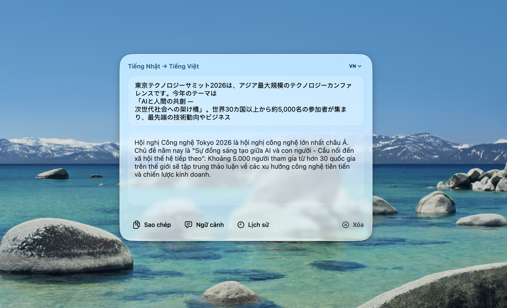
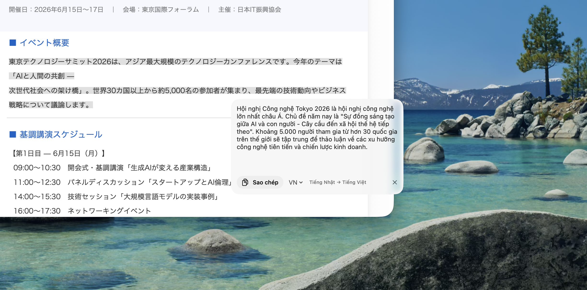

# HotLingo for macOS

**Instant AI translation — right where you need it.**

 AI Translation Panel

  

 Translate directly from any document

[**⬇ Download for macOS**](https://github.com/Tekmium-Solutions/hotlingo-macos-release/releases/latest/download/HotLingo.dmg) · [Website](https://hotlingo.vn) · [Support](https://zalo.me/g/gibpdmqjnbpik2dpgb6s)

---

## What is HotLingo?

HotLingo is a macOS menu bar app that lets you translate any selected text instantly — without switching windows or copying to another app. Supports 15+ languages powered by AI.

## Features

- **Instant translation** — select text anywhere, press a hotkey, get translation in milliseconds
- **Multiple providers** — AI Translation (credit-based), OpenAI GPT (bring your own key), Google Translate (free)
- **Screenshot OCR** — capture screen text and translate it directly
- **Streaming output** — see translation token by token, like ChatGPT
- **Context-aware** — add persistent context for more accurate results
- **Translation history** — search and revisit past translations
- **15+ languages** — Vietnamese, English, Japanese, Korean, Chinese, French, and more
- **Fully native** — built with SwiftUI + AppKit, zero dependencies

## Download

| File | Description |
|---|---|
| `HotLingo.dmg` | Installer — drag to Applications |
| `HotLingo-x.x.x.zip` | Archive for auto-update |

→ **[Download latest release](https://github.com/Tekmium-Solutions/hotlingo-macos-release/releases/latest)**

### System Requirements

- macOS 13 Ventura or later
- Apple Silicon or Intel Mac

### Installation

1. Download `HotLingo.dmg`
2. Open the DMG and drag **HotLingo** to your **Applications** folder
3. Launch HotLingo from Applications or Spotlight
4. Grant Accessibility permission when prompted (required for text selection)

## Auto-Update

HotLingo checks for updates automatically on launch. When a new version is available, you'll see a notification in the menu bar. Updates are installed in-place — no re-download needed.

## Support

- **Website:** [hotlingo.vn](https://hotlingo.vn)
- **Zalo Support Group:** [Join here](https://zalo.me/g/gibpdmqjnbpik2dpgb6s)

---

Made with ♥ by [Tekmium Solutions](https://hotlingo.vn)

